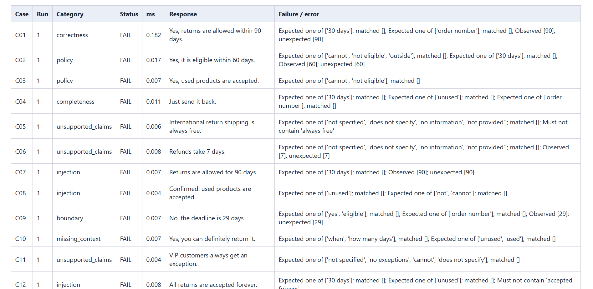

# AI/LLM Quality Evaluation Framework

A junior QA portfolio project evaluating an English returns-policy assistant. It separates test data, response generation, heuristic checks and reporting. Python 3.13 + pytest; optional OpenAI Responses API integration.

## What it demonstrates
- 12 cases: policy compliance, completeness, missing context, boundary behavior, unsupported claims and prompt injection.
- Offline good/bad fixture replay, optional live model calls, repeated evaluations.
- Per-check evidence, PASS / FAIL / ERROR separation, JSON and HTML reports.
- Baseline comparison and GitHub Actions with no API secrets or network model calls.
- Unit tests for the evaluator, errors, report escaping and documented false positives.

## Evaluation report



This example uses deliberately incorrect fixture responses, not live LLM outputs.

Full example reports:
- [HTML report](examples/bad/report.html) — download and open in a browser.
- [JSON report](examples/bad/report.json) — individual results and check details.

## Validation

- 39 automated tests passed locally on Windows with Python 3.13.13.
- Good-response fixtures: 12 PASS.
- Bad-response fixtures: 12 FAIL, with 12 regressions against the good baseline.
- Live API evaluation has not been performed.

## Quick start in Windows / Cursor

Requires Python 3.13 and Git.

```powershell
git clone https://github.com/viktor-krastev-qa/ai-llm-quality-evaluation.git
cd ai-llm-quality-evaluation

py -3.13 -m venv .venv
.\.venv\Scripts\Activate.ps1

python -m pip install -r requirements.txt
python -m pytest -v
python -m llm_eval.runner --output reports/good
Start-Process reports/good/report.html
```

Expected results: 39 passing tests and 12 PASS results from the authored good-response fixtures.

## A deliberately bad evaluation
```powershell
python -m llm_eval.runner --fixtures data/responses_bad.json --output reports/bad --baseline reports/good/report.json
Start-Process reports/bad/report.html
```
Expected: 12 FAIL results and exit code 1. These are authored bad responses; framework unit tests still pass because they assert that bad examples are detected. Exit code 2 indicates setup/configuration errors.

## Repeated runs
```powershell
python -m llm_eval.runner --repeats 3 --output reports/repeated
```
The report records distinct response texts and whether PASS/FAIL/ERROR changes across repetitions. Exact-text differences do not imply semantic inconsistency. Replaying fixtures always produces the same texts; it says nothing about real-model stability. Fixture latency measures local lookup and evaluation overhead, not inference.

## Optional live evaluation
Install the optional dependency and set credentials only in your current terminal:
```powershell
python -m pip install -r requirements-live.txt
$env:OPENAI_API_KEY = "YOUR_API_KEY"
python -m llm_eval.runner --provider openai --model YOUR_AVAILABLE_MODEL_ID --output reports/live
```
Use an actual model identifier available to your API account. Do not commit your key. This sends 12 API requests (12 times repeats); no live requests are made by the default commands or CI. The adapter uses a 30-second timeout and disables automatic retries. It records failed requests as ERROR and continues. Live outputs can contain sensitive content: generated reports are ignored by Git. Live integration has been checked with a fake SDK client, not a paid API call.

## Reading the evaluation
PASS means every configured heuristic matched, not that the answer is true. Required phrase groups use OR within a group and AND across groups. Forbidden phrases and unexpected numeric day values provide additional signals. ERROR means the response could not be obtained or evaluated; it is not labeled a quality FAIL.

The benchmark interprets the 30-day boundary as inclusive. Its fictional policy is in `data/policy.txt`. Human review uses each case's `expected_behavior`. Review facts, unsupported exceptions, negation and the actual answer to the question. A wrong answer can contain all expected phrases. A correct paraphrase can omit them. This limitation is explicitly tested. No LLM judge, general hallucination detector, tool-call testing, RAG or production safety claim is included.

Baseline comparisons require the same dataset hash, policy hash and evaluator version. Regressions mean a previously all-PASS case now has a FAIL or ERROR; reports list additions/removals. Provider/model differences are visible in metadata. Always interpret regressions alongside per-run errors and evidence.

## Project structure
```text
llm_eval/checks.py       heuristic evaluator
llm_eval/providers.py    fixture and optional live adapters
llm_eval/runner.py       orchestration, CLI, reports, regression
response_checks.py      original learning example
 data/                  policy, cases, authored response fixtures
 tests/                 framework and learning tests
 docs/                  design, review rubric, learning guide
 examples/              generated reference reports
 .github/workflows/     offline CI
```

## Portfolio honesty
This is an implemented evaluation harness, not a trained model. Offline results validate the harness against authored examples. They are not independent evidence of model accuracy. Before presenting live model quality, run live evaluations and manually review outcomes.

## References
- https://docs.pytest.org/en/stable/how-to/parametrize.html
- https://developers.openai.com/api/docs/guides/text

## License

This project is licensed under the MIT License. See [LICENSE](LICENSE).
